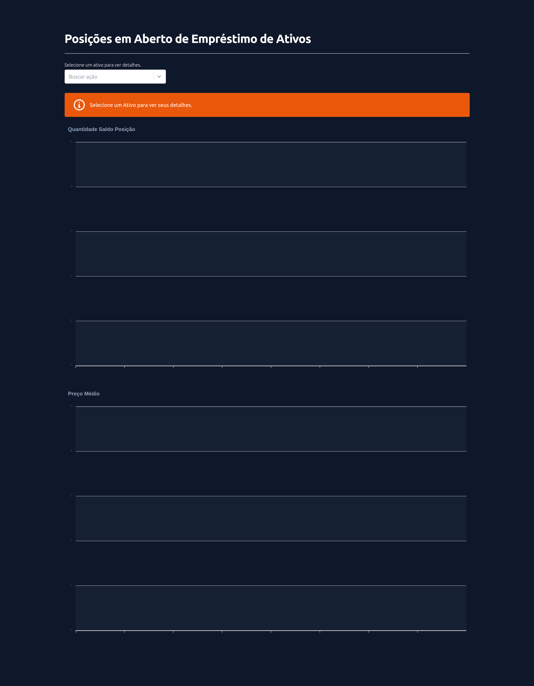
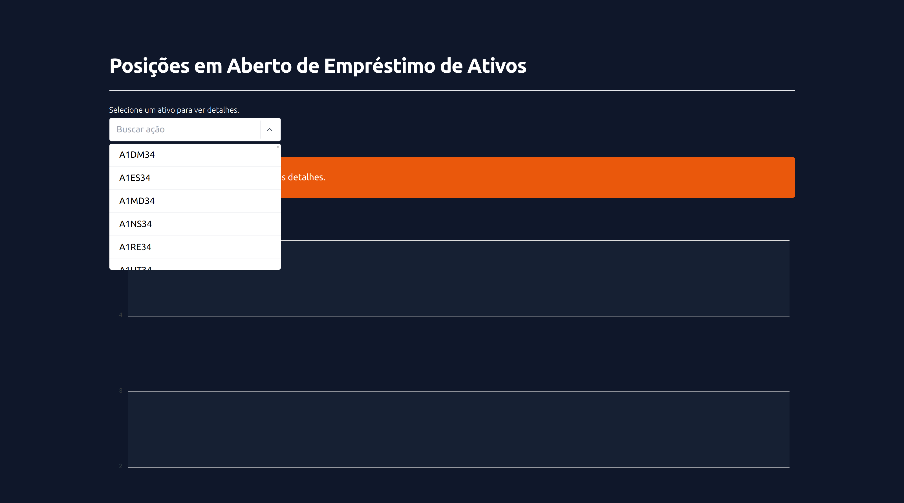
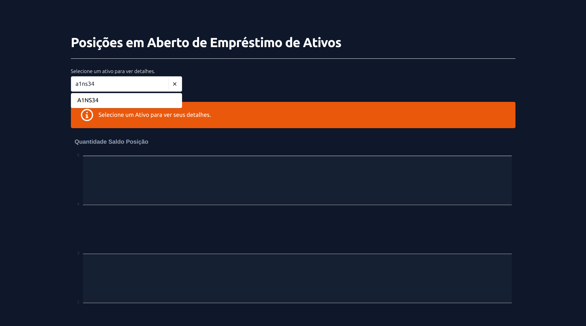
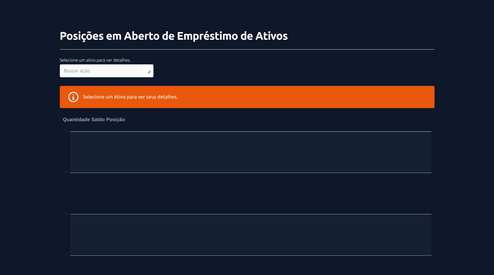
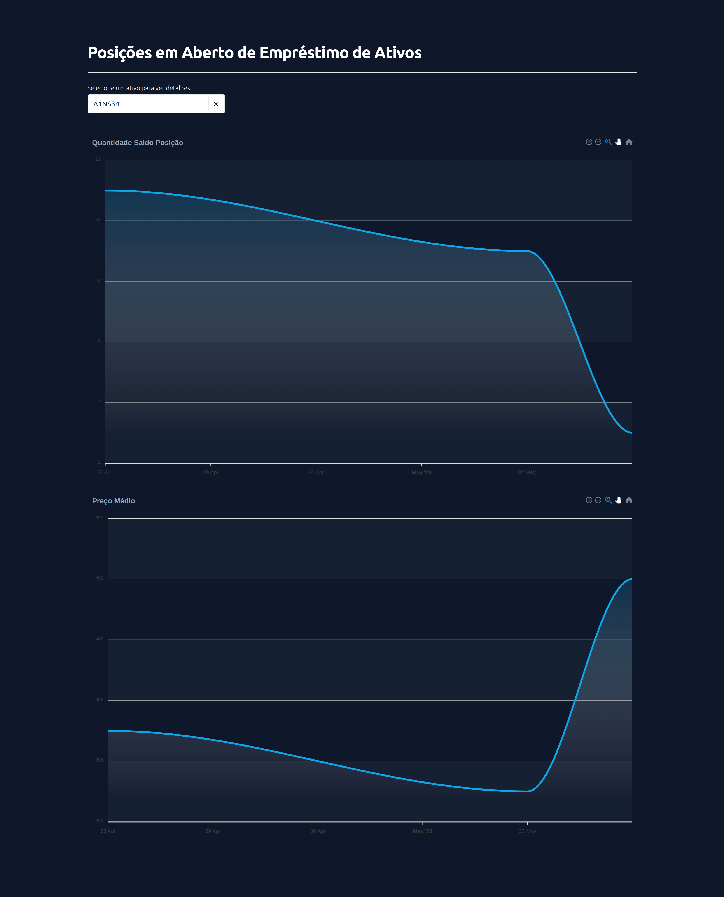
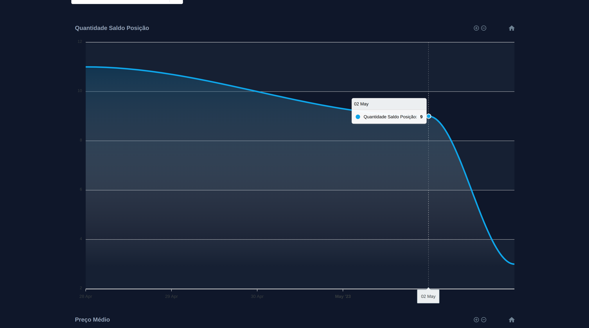

# Test Laravel B3

### Versions

-   [Laravel: v9](https://laravel.com/docs/9.x/installation)
-   [Excel: v3.1](https://laravel-excel.com/)
-   [Node: v16.16.0](https://nodejs.org/en)
-   [Vue: v3](https://vuejs.org/)
-   [Vuex: 4.0.2](https://vuex.vuejs.org/installation.html)
-   [Axios: v1.1.2](https://axios-http.com/ptbr/docs/intro)
-   [Vue3-apexcharts: v1.4.1](https://apexcharts.com/docs/vue-charts/)

### Installation Process

-   `composer install`
-   `npm i`
-   `php artisan key:generate`
-   `php artisan storage:link`

-   Para ver em tempo real o processo de captura e salvamento de dados no banco: `php artisan command:update-actions {quantidade de dias}`
    -   Por exemplo: `php artisan command:update-actions 18`

### Run

-   `npm run dev`
-   `php artisan serve`

### Print's

